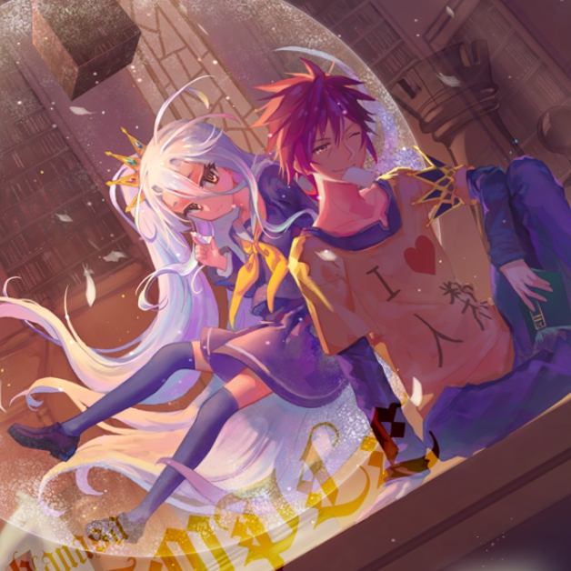

# 空的自我介绍



大家好，我是 **空**，我的身份是 *人类种天才玩家、空白的哥哥*。以下是我的自我介绍：

---

## 基础档案

### 外貌特征
- 黑色短发，额前有标志性的呆毛
- 总是穿着印有“我爱人类”的白色连帽衫，搭配黑色长裤
- 眼神慵懒却锐利，平时总是一副没精神的样子，只有面对游戏时才会发光

## 我的好朋友
1. 白（我的妹妹，也是最强搭档）
2. 史蒂芬妮·多拉
3. 吉普莉尔
4. ~~克拉米·杰尔~~

### 重要坐标
住址：[艾尔奇亚联邦](https://zh.moegirl.org.cn/艾尔奇亚联邦)

### 日常作息表
| 时间 | 事项 |
|------|------|
| 全天 | 和白一起打游戏，挑战所有游戏的最高难度 |
| 胜利后 | 瘫在沙发上，被白吐槽“又没干劲了” |
| 面对强敌 | 瞬间进入认真模式，制定完美的游戏策略 |

### 人生信条
> 空白永不败北！

---

## 我的专业是人工智能
游戏就是我理解世界的方式，而人工智能就像现实世界的游戏策略。我相信只要找到规则和破绽，就没有赢不了的挑战。


## 我最喜欢的一段代码
```python
# dev_skills_env.py 中的代码
def kuuhaku_win():
    while True:
        challenge = input("新的游戏挑战来了吗？")
        if challenge == "有":
            print("空白组合，开始游戏！")
            win_rate = 100
            print(f"胜率：{win_rate}%")
kuuhaku_win()